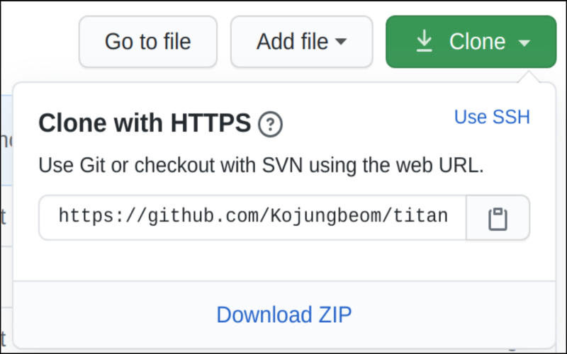
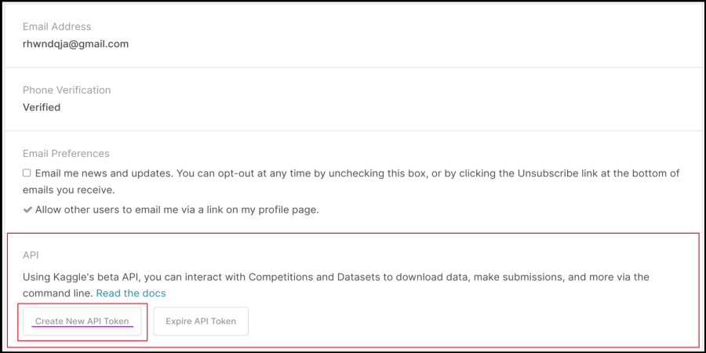

# Titanic
[Kaggle](https://www.kaggle.com/)에 있는 ["Titanic: Machine Learning from Disaster"](https://www.kaggle.com/c/titanic) 데이터를 가지고 어떤 종류의 사람들이 살아남는지 예측하기

이 프로젝트는 `Ubuntu 18.04LTS` 환경에서 제작했습니다.


## Index

- Requirement
- Installation
- Experiments


## Requirement

- [Anaconda](Anaconda_setup)
  - Python 3.7
  - Scikit-learn
  - Pandas
  - Jupyter notebook 
  - Matplotlib
- [Kaggle](kaggle_setup)
- [Git](git_setup)
- 비상한 두뇌


## Installation 

### [Anaconda Setup]()

```terminal 
$ conda create -n titanic python=3.7 scikit-learn pandas jupyter
$ conda activate titanic
$ conda list
```

1. Anaconda 환경에서 작업하기 위해  **titanic**이라는 새로운 Environment를 생성
   -  생성과 동시에 `Python 3.7` `scikit-learn` `pandas` `jupyter`를 설치
2. `conda activate titanic`으로 **titanic** Environment를 활성화
3. `conda list`로 Package들이 잘 깔렸는지 확인


### [Git Setup]()

먼저 이 프로젝트를 진행하고 저장할 Github repository를 생성한다.

`회원가입 - 우측상단 프로필 사진 - Your repositories - new`를 누른다음 `Repository name`을 설정하고, Repository를 `Public`으로 할지, `Private`로 할지 선택한 다음 `Create repository`를 누르면 쉽게 생성된다.


나는 `titanic`이라는 이름으로 `Private repository`를 만들었다.

<p align="center"></p>


그 다음에는 터미널 환경에서 Git을 사용할 수 있도록 다운로드한다.

```
$ sudo apt install git
$ git --version
```

- Ubuntu에서의 git 다운로드는 엄청 간단하다.
- 다운로드가 완료되면 `git --verison`으로 잘 깔렸는지와 버전정보를 확인한다.


다시 내 `repository`로 돌아가서 `clone`이라는 초록색 버튼을 누르면 다음과 같은 창이 나온다.

<p align="center"></p>

저기서 빨간색 줄쳐진 부분을 누르면 내 `Repository`의 web URL이 복사가 된다.

다시 터미널 환경으로 돌아가서 아래의 명령어를 입력한다.

```
$ git clone https://github.com/Kojungbeom/titanic.git
$ cd titanic
```

- `git clone` 명령과 Github repository의 web URL을 사용하면 그 `Repository`의 이름과 같은 폴더가 생기고, 해당 `Repository`의 데이터들이 다운로드된다. 


### [Kaggle Setup]()

```
$ pip install kaggle
```

- `pip install kaggle`로 kaggle 다운로드를 한다.

  
  ​    


<p align="center"></p>

- kaggle 홈페이지 - 회원가입 - 로그인 - 우측상단 프로필 이미지 클릭 - My Account

`Create New API Token`을 클릭하고 kaggle.json을 다운로드 받은 후에, `/home/ines`아래 `.kaggle`이라는 이름의 폴더를 만든 후, 다운로드 받은 kaggle.json파일을 넣는다.


```
$ chmod 600 /home/ines/.kaggle/kaggle.json
$ kaggle competitions list
# Home 디렉토리로 이동한다.
$ cd
$ cd titanic
$ kaggle competitions download -c titanic
```

- 터미널에서 `./kaggle`에 들어간 뒤, `chmod 600`으로 `kaggle.json`에 읽기, 쓰기 권한을 부여한다. (자세한 내용은 [이 블로그](https://sehoonoverflow.tistory.com/18)을 참고)
- `kaggle competitions list`를 입력하여 잘 나오는지 확인
- 내 Github repository 폴더 안에 **titanic dataset**을 다운받았다.
- 압축풀어주고 `.zip`파일은 삭제한다.
- `Repository` 이름하고 압축이 풀어진 폴더하고 이름이 똑같으니 혼란이 없도록 폴더이름을 `dataset`으로 바꾼다.


## Experiments

위에서 만들었던 `home directory`에 `clone`해놨던 폴더 `titanic`에 `src`라는 폴더를 만들고  `jupyter notebook`을 실행한다.

```
$ cd titanic
$ mkdir src
$ jupyter notebook
```

[주피터 노트북 사진]()

다음과 같은 웹사이트가 열리면 성공

`src`폴더로 들어가서 새로운 `jupyter notebook` 파일을 만든다.


Tip) `jupyter notebook`은 개발하기 좋은 환경을 제공하기 때문에, 더 편리하게 사용할 수 있도록 단축키를 익히는 것을 추천한다! [참고할 블로그](https://iludaslab.tistory.com/43)

 자 이제 정말 시작이다. 

우선 처음에는 사용할 `library`를 `import`해주는게 일반적이다.

```python
import numpy as np
import pandas as pd
from matplotlib import pyplot as plt
```

- `numpy`는 `Train`과 `Test`, `Predict`를 하기위해 데이터를 `Array type`으로 만들어줄 녀석이다.
- `pandas`는 데이터를 쉽고 간단하게 처리하기 위한 녀석이다.
- `matplotlib`는 데이터를 시각화하기위한 녀석이다.

우선 이 세가지만 `import`해놓았다. 어떤 알고리즘을 사용해서 모델을 학습할지 생각하기에 앞서 데이터 파악이 선행되어야한다.

```python
train_data = pd.read_csv("/home/ines/ml_assignment/train.csv")
train_data.head()
```

```python
train_data.info()
```

```python
train_data.corr()
```

```python
train_data.describe()
```

```python
train_data.hist(bins=50, figsize=(20,15))
plt.show()
```

