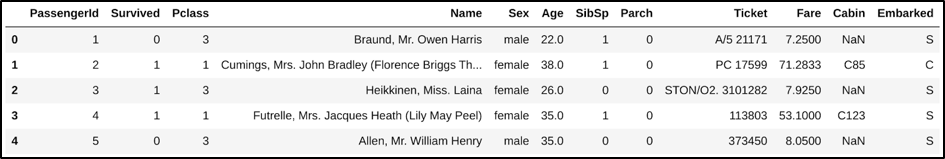
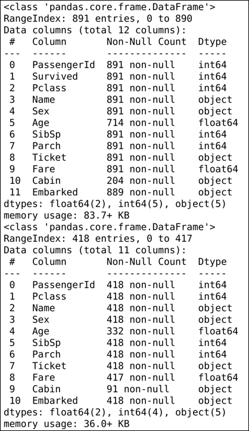
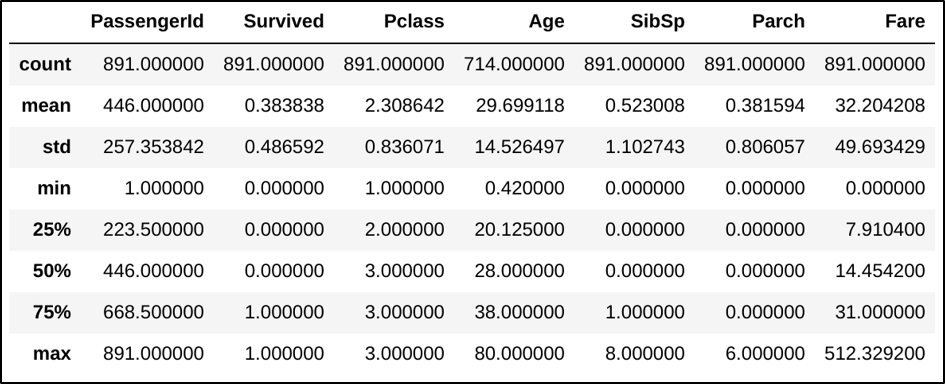
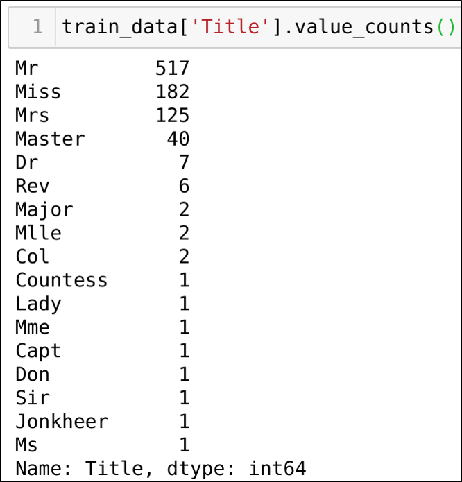
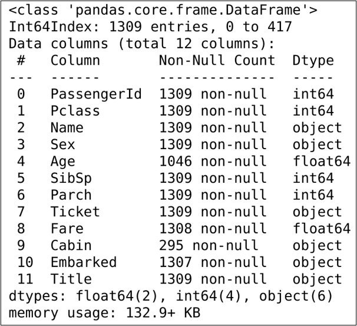
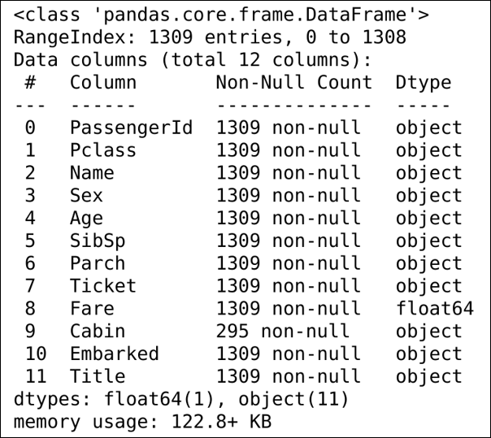
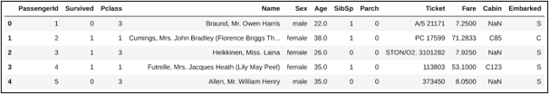
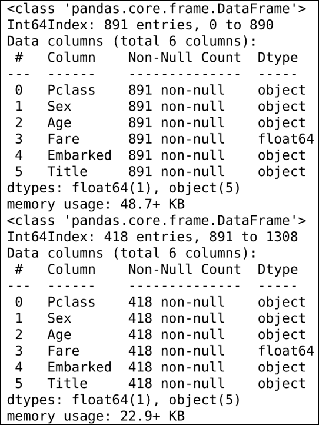
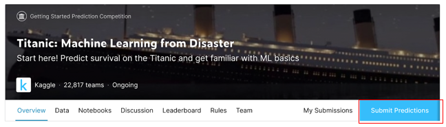
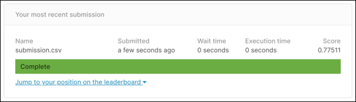

# Titanic
[Kaggle](https://www.kaggle.com/)에 있는 ["Titanic: Machine Learning from Disaster"](https://www.kaggle.com/c/titanic) 데이터를 가지고 어떤 종류의 사람들이 살아남는지 예측하기

이 프로젝트는 `Ubuntu 18.04LTS` 환경에서 제작했습니다.


## Index

- Requirement
- Installation
- Experiments


## Requirement

- [Anaconda](Anaconda_setup)
  - Python 3.7
  - Scikit-learn
  - Pandas
  - Jupyter notebook 
  - Matplotlib
- [Kaggle](kaggle_setup)
- [Git](git_setup)


## Installation 

### [Anaconda Setup]()

```terminal 
$ conda create -n titanic python=3.7 scikit-learn pandas jupyter
$ conda activate titanic
$ conda list
```

1. Anaconda 환경에서 작업하기 위해  **titanic**이라는 새로운 Environment를 생성
   -  생성과 동시에 `Python 3.7` `scikit-learn` `pandas` `jupyter`를 설치
2. `conda activate titanic`으로 **titanic** Environment를 활성화
3. `conda list`로 Package들이 잘 깔렸는지 확인


### [Git Setup]()

먼저 이 프로젝트를 진행하고 저장할 Github repository를 생성한다.

`회원가입 - 우측상단 프로필 사진 - Your repositories - new`를 누른다음 `Repository name`을 설정하고, Repository를 `Public`으로 할지, `Private`로 할지 선택한 다음 `Create repository`를 누르면 쉽게 생성된다.


나는 `titanic`이라는 이름으로 `Private repository`를 만들었다.

<p align="center"></p>


그 다음에는 터미널 환경에서 Git을 사용할 수 있도록 다운로드한다.

```
$ sudo apt install git
$ git --version
```

- Ubuntu에서의 git 다운로드는 엄청 간단하다.
- 다운로드가 완료되면 `git --verison`으로 잘 깔렸는지와 버전정보를 확인한다.


다시 내 `repository`로 돌아가서 `clone`이라는 초록색 버튼을 누르면 다음과 같은 창이 나온다.

<p align="center"></p>

저기서 빨간색 줄쳐진 부분을 누르면 내 `Repository`의 web URL이 복사가 된다.

다시 터미널 환경으로 돌아가서 아래의 명령어를 입력한다.

```
$ git clone https://github.com/Kojungbeom/titanic.git
$ cd titanic
```

- `git clone` 명령과 Github repository의 web URL을 사용하면 그 `Repository`의 이름과 같은 폴더가 생기고, 해당 `Repository`의 데이터들이 다운로드된다. 


### [Kaggle Setup]()

```
$ pip install kaggle
```

- `pip install kaggle`로 kaggle 다운로드를 한다.

  
  ​    


<p align="center"></p>

- kaggle 홈페이지 - 회원가입 - 로그인 - 우측상단 프로필 이미지 클릭 - My Account

`Create New API Token`을 클릭하고 kaggle.json을 다운로드 받은 후에, `/home/ines`아래 `.kaggle`이라는 이름의 폴더를 만든 후, 다운로드 받은 kaggle.json파일을 넣는다.


```
$ chmod 600 /home/ines/.kaggle/kaggle.json
$ kaggle competitions list
# Home 디렉토리로 이동한다.
$ cd
$ cd titanic
$ kaggle competitions download -c titanic
```

- 터미널에서 `./kaggle`에 들어간 뒤, `chmod 600`으로 `kaggle.json`에 읽기, 쓰기 권한을 부여한다. (자세한 내용은 [이 블로그](https://sehoonoverflow.tistory.com/18)을 참고)
- `kaggle competitions list`를 입력하여 잘 나오는지 확인
- 내 Github repository 폴더 안에 **titanic dataset**을 다운받았다.
- 압축풀어주고 `.zip`파일은 삭제한다.
- `Repository` 이름하고 압축이 풀어진 폴더하고 이름이 똑같으니 혼란이 없도록 폴더이름을 `dataset`으로 바꾼다.


## Experiments

위에서 만들었던 `home directory`에 `clone`해놨던 폴더 `titanic`에 `src`라는 폴더를 만들고  `jupyter notebook`을 실행한다.

```
$ cd titanic
$ mkdir src
$ jupyter notebook
```

[주피터 노트북 사진]()

다음과 같은 웹사이트가 열리면 성공

`src`폴더로 들어가서 새로운 `jupyter notebook` 파일을 만든다.


Tip) `jupyter notebook`은 개발하기 좋은 환경을 제공하기 때문에, 더 편리하게 사용할 수 있도록 단축키를 익히는 것을 추천한다! [참고할 블로그](https://iludaslab.tistory.com/43)

 

자 이제 정말 시작이다. 

우선 처음에는 사용할 `library`를 `import`해주는게 일반적이다.

```python
import numpy as np
import pandas as pd
from matplotlib import pyplot as plt
```

- `numpy`는 `Train`과 `Test`, `Predict`를 하기위해 데이터를 `Array type`으로 만들어줄 녀석이다.
- `pandas`는 데이터를 쉽고 간단하게 처리하기 위한 녀석이다.
- `matplotlib`는 데이터를 시각화하기위한 녀석이다.

우선 이 세가지만 `import`해놓았다. 어떤 알고리즘을 사용해서 모델을 학습할지 생각하기에 앞서 데이터 파악이 선행되어야한다.


### 데이터 불러오고 살펴보기

```python
train_data = pd.read_csv("/home/ines/ml_assignment/train.csv")
test_data = pd.read_csv("/home/ines/titanic/dataset/test.csv")
train_data.head()
```

<p align="center"></p>

```python
train_data.info()
test_data.info()
```

<p align="center"></p>

```python
train_data.describe()
```

<p align="center"></p>


### [새로운 Title column 만들기]([https://teddylee777.github.io/kaggle/kaggle(%EC%BA%90%EA%B8%80)-Titanic-%EC%83%9D%EC%A1%B4%EC%9E%90%EC%98%88%EC%B8%A1-81-%EC%9D%B4%EC%83%81-%EB%8B%AC%EC%84%B1%ED%95%98%EA%B8%B0](https://teddylee777.github.io/kaggle/kaggle(캐글)-Titanic-생존자예측-81-이상-달성하기)

```python
def makeTitle(data):
    data['Title'] = data['Name'].str.extract(' ([A-Za-z]+)\.', expand = False)

makeTitle(test_data)
makeTitle(train_data)
```

이름에 붙어있는 `Mr`, `Mrs` 같은 수식어를 추출해서 `Title`이라는 새로운 Column을 Training data와 test_data에 만들었다. `value_counts()`로 확인한 결과는 다음과 같았다.

<p align="center"></p>

다음에는 `Train_data`에만 있는 `Survived` column을 `drop`시키고 `test_data` 와 결합시켜서 같이 가공한다.

```python
# 데이터 합쳐서 가공하기
all_data = pd.concat([train_data, test_data], axis=0)
all_data.info()
```

<p align="center"></p>

위 정보에 따르면 `Age`, `Fare`, `Embark`, `Cabin`에서 결측값이 있다!


```python
# 결측값을 채우기위한 평균값 준비
mr_mean = all_data[train_data['Title'] == 'Mr']['Age'].mean()
miss_mean = all_data[train_data['Title'] == 'Miss']['Age'].mean()
mrs_mean = all_data[train_data['Title'] == 'Mrs']['Age'].mean()
master_mean = all_data[train_data['Title'] == 'Master']['Age'].mean()
dr_mean = all_data[train_data['Title'] == 'Dr']['Age'].mean()
rev_mean = all_data[train_data['Title'] == 'Rev']['Age'].mean()
major_mean = all_data[train_data['Title'] == 'Major']['Age'].mean()
mlle_mean = all_data[train_data['Title'] == 'Mlle']['Age'].mean()
col_mean = all_data[train_data['Title'] == 'Col']['Age'].mean()
age_mean = all_data['Age'].mean()
```

`Age` 열의 비어있는곳은 어떻게 채워줄까 하다가, 만들어낸 `Title` data를 가지고 각 `Title`의 나이의 평균으로 넣어주는게 좋겠다고 생각하여, 존재하는 `Age`데이터를 이용해서 각각의 평균을 구해냈다. 하나밖에 없는 `Title`항목에 대해서는 굳이 평균을 만들지 않았다.


```python
all_array_data = np.array(all_data)

# NaN값은 이렇게 접근해야 한다고 한다.
for data in all_array_data:
    if np.isnan(data[4]):
        if data[11] == 'Mr':
            data[4] = round(mr_mean)
            #print("OK")
        elif data[11] == 'Miss':
            data[4] = round(miss_mean)
            #print("OK")
        elif data[11] == 'Mrs':
            data[4] = round(mrs_mean)
            #print("OK")
        elif data[11] == 'Master':
            data[4] = round(master_mean)
            #print("OK")
        elif data[11] == 'Dr':
            data[4] = round(dr_mean)
            #print("OK")
        elif data[11] == 'Rev':
            data[4] = round(rev_mean)
            #print("OK")
        elif data[11] == 'Major':
            data[4] = round(major_mean)
            #print("OK")
        elif data[11] == 'Mlle':
            data[4] = round(mlle_mean)
            #print("OK")
        elif data[11] == 'Col':
            data[4] = round(col_mean)
            #print("OK")
        else:
            data[4] = round(age_mean)
            #print("OK")
```


array로 바꿔서 처리하고나니까 `column name`이 다 없어져서 다시 정의해주고, 새로운 데이터프레임을 만들었다.

```python
column_list = ['PassengerId', 'Pclass', 'Name', 'Sex', 'Age', 'SibSp', 'Parch', 'Ticket', 'Fare', 'Cabin', 'Embarked', 'Title']
new_all_data = pd.DataFrame(all_array_data, columns=column_list)

# 나머지 남아있는 결측값은 결측값 위치의 바로 위의 값으로 결측값을 채우는 방법으로!
new_all_data['Embarked'] = new_all_data['Embarked'].fillna(method='pad')
new_all_data['Fare'] = new_all_data['Fare'].fillna(method='pad')

# 전부 채워진걸 확인
new_all_data.info()
```

<p align="center"></p>

위에 보이는 것 처럼 결측값들은 전부 없어졌다.


### 데이터 매핑

이제 `Training`에 사용할 데이터를 매핑하고, 나머지는 `drop`시키는 작업이 필요하다

```python
# 연령대 별로 나누기
for data in [new_all_data]:
    data.loc[data['Age'] <= 10, 'Age'] = 0,
    data.loc[(data['Age'] > 10) & (data['Age'] <= 20), 'Age'] = 1,
    data.loc[(data['Age'] > 20) & (data['Age'] <= 30), 'Age'] = 2,
    data.loc[(data['Age'] > 30) & (data['Age'] <= 40), 'Age'] = 3,
    data.loc[(data['Age'] > 40) & (data['Age'] <= 50), 'Age'] = 4,
    data.loc[(data['Age'] > 50) & (data['Age'] <= 60), 'Age'] = 5,
    data.loc[(data['Age'] > 60) & (data['Age'] <= 70), 'Age'] = 6,
    data.loc[data['Age'] > 70, 'Age'] = 7
```

- `Age`는 연령대별로 Interval을 주어 나누었다.

  

```python
# 클래스별 Fare의 평균값을 이용해서 경계만들어서 매핑
p1 = new_all_data[new_all_data['Pclass']==1]
p2 = new_all_data[new_all_data['Pclass']==2]
p3 = new_all_data[new_all_data['Pclass']==3]
p1_mean = p1['Fare'].mean()
p2_mean = p2['Fare'].mean()
p3_mean = p3['Fare'].mean()
r1 = (p2_mean - p3_mean) / 2
r2 = (p1_mean - p2_mean) / 2

for data in [new_all_data]:
    data.loc[data['Fare'] <= p3_mean+r1, 'Fare'] = 0,
    data.loc[(data['Fare'] > p3_mean+r1) & (data['Fare'] <= p2_mean+r2), 'Fare'] = 1,
    data.loc[data['Fare'] > p2_mean+r2, 'Fare'] = 2
```

- `Fare`는 각각 `Pclass`와 연관성을 가지고있어서 각 `Pclass`에서 `Fare`의 평균값을 구해서 Interval을 나누는 용도로 사용하였다.


```python
# 성별 매핑
for data in [new_all_data]:
    data.loc[data['Sex'] == 'male', 'Sex'] = 0,
    data.loc[data['Sex'] == 'female', 'Sex'] = 1
```

- `Sex`은 간단하게 0과 1로 나눠주었다.


```python
# Embarked 매핑
for data in [new_all_data]:
    data.loc[data['Embarked'] == 'S', 'Embarked'] = 0,
    data.loc[data['Embarked'] == 'C', 'Embarked'] = 1,
    data.loc[data['Embarked'] == 'Q', 'Embarked'] = 2
```

- `Embarked`도 간단하게 3개로 나눠주었다.


```python
# 타이틀을 매핑, 개수가 작은 Title들은 나머지와 묶어서 처리
for data in [new_all_data]:
    data.loc[data['Title'] == 'Mr', 'Title'] = 0,
    data.loc[data['Title'] == 'Miss', 'Title'] = 1,
    data.loc[data['Title'] == 'Mrs', 'Title'] = 2
    data.loc[data['Title'] == 'Master', 'Title'] = 3,
    data.loc[data['Title'] == 'Dr', 'Title'] = 4,
    data.loc[data['Title'] == 'Rev', 'Title'] = 4,
    data.loc[data['Title'] == 'Col', 'Title'] = 4,
    data.loc[data['Title'] == 'Major', 'Title'] = 4,
    data.loc[data['Title'] == 'Sir', 'Title'] = 4,
    data.loc[data['Title'] == 'Countess', 'Title'] = 4,
    data.loc[data['Title'] == 'Don', 'Title'] = 4,
    data.loc[data['Title'] == 'Jonkheer', 'Title'] = 4,
    data.loc[data['Title'] == 'Lady', 'Title'] = 4,
    data.loc[data['Title'] == 'Ms', 'Title'] = 4,
    data.loc[data['Title'] == 'Capt', 'Title'] = 4,
    data.loc[data['Title'] == 'Mme', 'Title'] = 4
    data.loc[data['Title'] == 'Mlle', 'Title'] = 4
    data.loc[data['Title'] == 'Dona', 'Title'] = 4
```

- 처음에 만들었던 `Title`같은 경우는 값이 많은 것들은 단독으로 매핑하고, 나머지 값이 적은 것들은 묶어서 하나의 Class로 처리하였다.


```python
new_all_data.head()
```

<p align="center"></p>

이제 Training에 사용되지 않을 Feature들을 제거한다.

```python
# 매핑을 마쳤으니 나머지 못쓸것같은 데이터들은 다 버린다.
drop_list = ['Ticket', 'SibSp', 'Parch', 'Name', 'Cabin', 'PassengerId']

# 아까 묶어놨던 데이터를 다시 분리한다.
final_train_data = new_all_data[new_all_data['PassengerId']<=891]
final_test_data = new_all_data[new_all_data['PassengerId']>891]

final_train_data = final_train_data.drop(drop_list, axis=1)
final_test_data = final_test_data.drop(drop_list, axis=1)

final_train_data.info()
final_test_data.info()
```

<p align="center"></p>


### Training

```python
from sklearn.model_selection import cross_val_score
from sklearn.tree import DecisionTreeClassifier
from sklearn.neighbors import KNeighborsClassifier
from sklearn.ensemble import RandomForestClassifier
from sklearn.svm import SVC
```

어떤 모델을 쓸까하다가 여러가지를 써보고 성능을 비교한 후, 가장 좋은 Model로 사용하기로 했다.

```python
label_data = pd.read_csv("/home/ines/titanic/dataset/test.csv")

label = label_data['Survived']

# knn은 hyperparameter를 바꿔가며 해봤으니 그저그런 성능
knn_clf = KNeighborsClassifier(n_neighbors = 8)
score = cross_val_score(knn_clf, final_train_data, label, cv=5, scoring='accuracy')
print(score)

# estimator의 개수가 60개를 넘어가면서 점차 성능이 감소
rf_clf = RandomForestClassifier(n_estimators=60)
score = cross_val_score(rf_clf, final_train_data, label, cv=5, scoring='accuracy')
print(score)

# C가 1~300까지 어느정도 일정하게 유지되다가 그이상 더 커지거나 작아지면 내려감
# C가 40 즈음에서 가장 좋은 성적
svm_clf = SVC(C=40)
score = cross_val_score(svm_clf, final_train_data, label, cv=5, scoring='accuracy')
print(score)
```

- label을 생성해주고, 모델들을 `Cross_val_score`을 이용해서 성능을 평가한다.

  

각각의 모델이 받은 점수는 다음과 같았다.

```
KNN
[0.81005587 0.78651685 0.76404494 0.78651685 0.80898876]

Random Forest
[0.81564246 0.78651685 0.82022472 0.7752809  0.83146067]

SVM
[0.83798883 0.80898876 0.83707865 0.78089888 0.86516854]
```


### SVM으로 제출할 파일 만들기

svm이 가장 좋은 성능을 보였기 때문에, 이 모델을 이용해서 Prediction을 한다.

```python
svm_clf.fit(final_train_data, label)
predictions = svm_clf.predict(final_test_data)
```

이제 만들어진 Prediction으로 제출용 파일 `submission.csv`를 만든다.

```python
submission = pd.DataFrame({"PassengerId" : test_data['PassengerId'],
                          "Survived" : predictions})
submission.to_csv('submission.csv', index=False)
submission = pd.read_csv('submission.csv')
submission.head()
```

위의 코드를 실행하면 자신의 코드가 있는 폴더에 `submission.csv`가 만들어진걸 확인할 수 있다!


# Submission file 제출

<p align="center"></p>

- 여기에서 `Submit Predictions` 클릭한 뒤, 파일을 올리고, `Make Submission`을 클릭하면 다음과 같이 점수를 볼 수가 있다.

<p align="center"></p>

